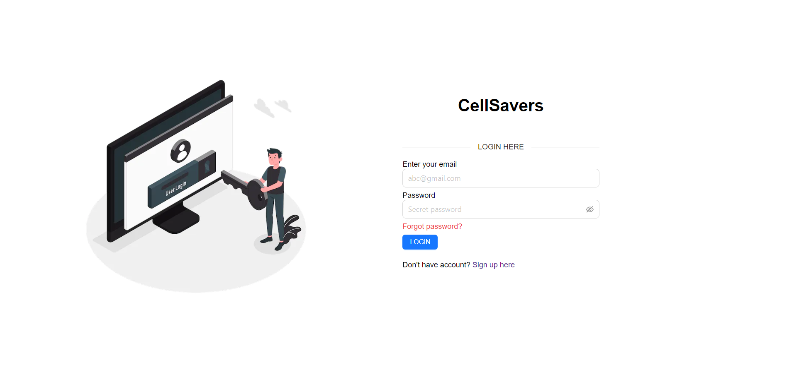
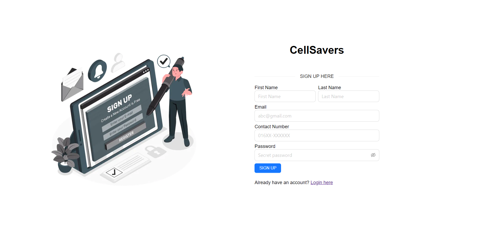
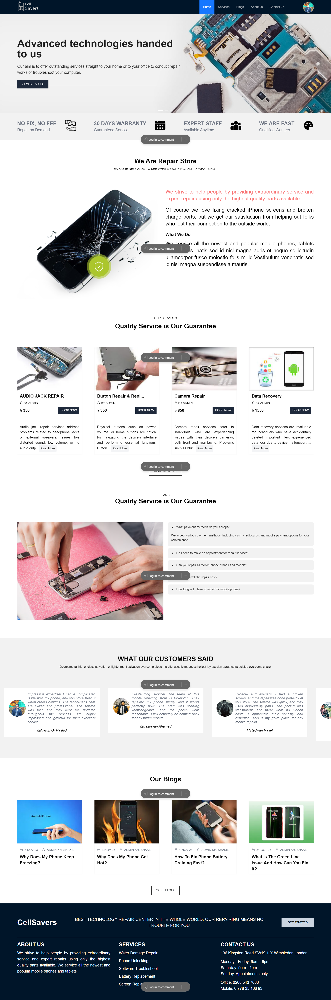

# Cell Savers (Mobile Repairing Center)

Cell Savers is a mobile repair booking system project. In this project, users can log in to different roles such as Super Admin, Admin, Technician, and Customer. This project has several types of services for repairing mobile based on customer requirements. After getting the service, the user can rate the service and also share their feedback.

---

## Important links-

- [CellSavers Frontend live site](https://cellsavers-frontend-khshakilahamed.vercel.app/)
- [CellSavers Backend github](https://github.com/khshakilahamed/cell-savers-backend)
- [CellSavers Backend live](https://cell-savers-backend.vercel.app/api/v1)
- [ER Diagram link](https://drive.google.com/file/d/1ojSbXIuJrskiOZ_y7eJVQQAlQ4jpwbvI/view?usp=sharing)

---

## The main features

- This project is a multi-role-based authentication system and applied authorization using JWT Token.
- Only customers can register to create an account. The technician account could be created by Admin. Admin account could be created by Super Admin.
- Technician, Admin, and super admin roles can be changeable.
- A customer can book only one service daily.
- After booking a slot by customer, the admin & super admin need to confirm the booking. After that, the technician can provide the service.
- Technician can not cancel any booking but admin, and super admin can do that. A customer also cancels the booking themselves.
- Customers can give feedback about our service and website. Even a customer can give a review for a specific booking.
- The feedback and reviews will be saved into the database. The admin can check the feedback to display on the homepage of the website.
- Admin and super admin has access to create blogs and FAQ.
- Service and time slots could be created by admin and super admin.

---

## Login page

## Register page

## Landing page

